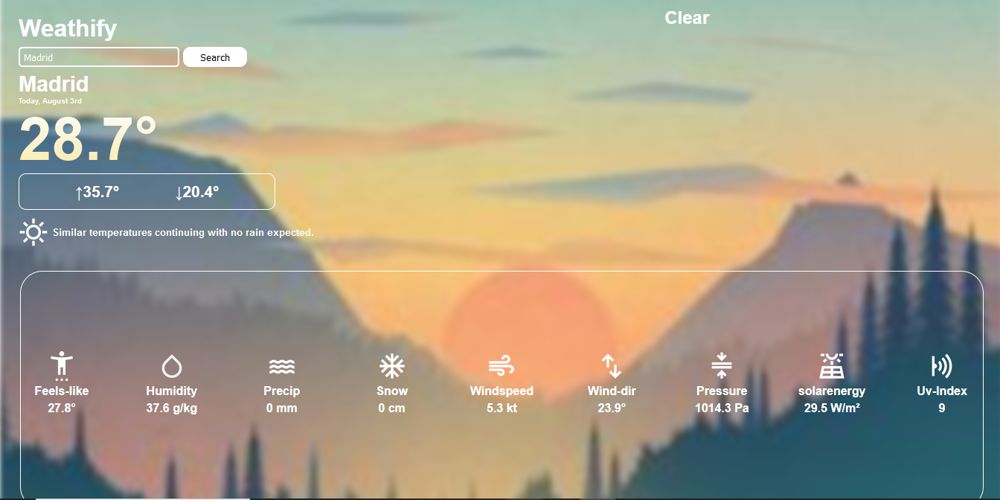
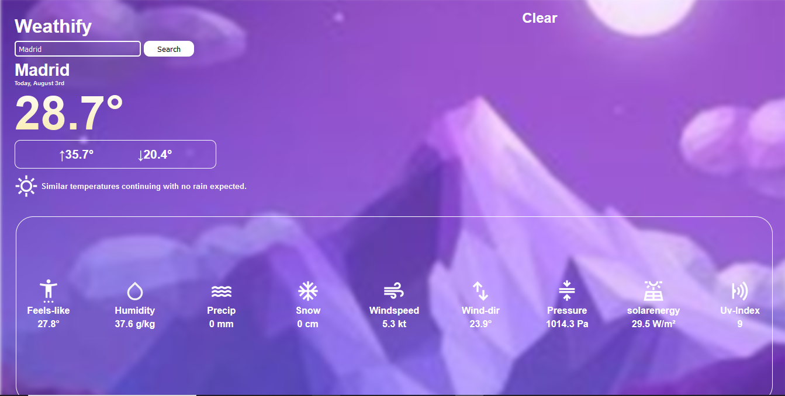
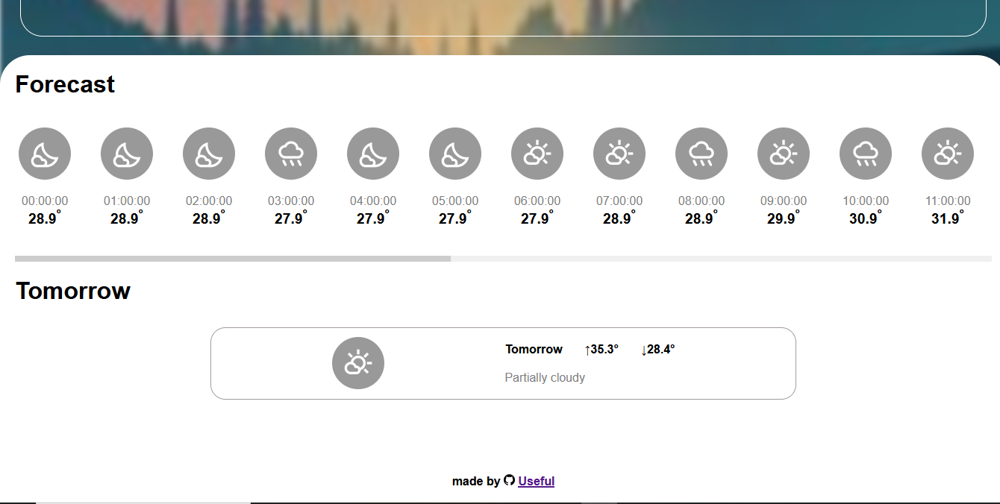
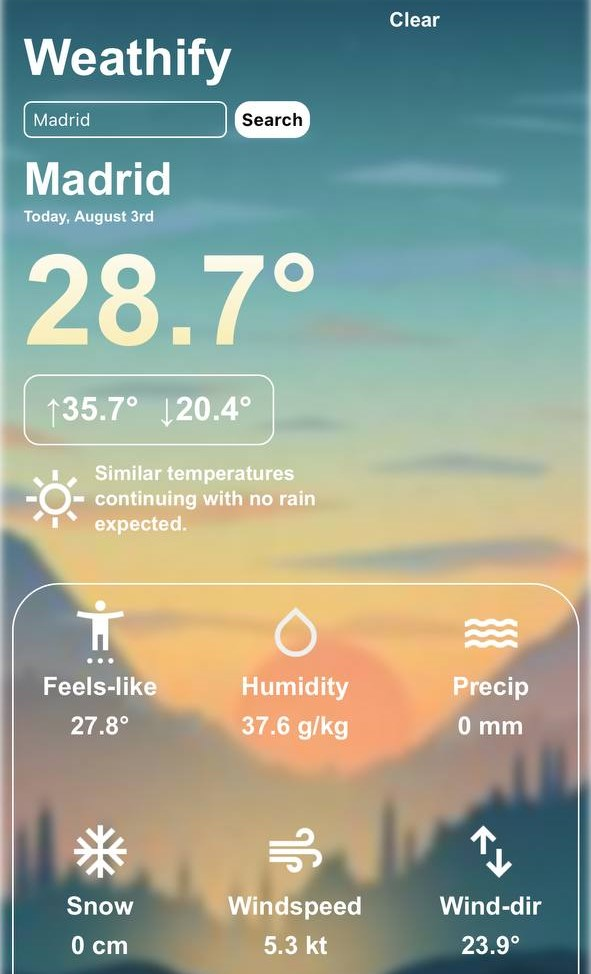
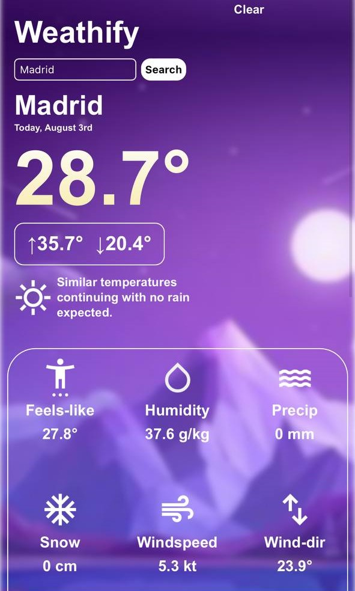

# Weathify
-this project is part of the odin project course!

## Home page for desktop (day version)

## Home page for desktop (night version)

## Tomorrow forecast

## Home page for mobile (day version)

## Home page for mobile (night version)

## What i learned:
-Got more practice on using API and asynch javascript

-Begining to understand promises better and using async/wait

-Got more practice on using media queries and used css loaders for the first time

-Getting slightly better at problem solving and logical thinking

-got more grasp on project directory structure and code organization